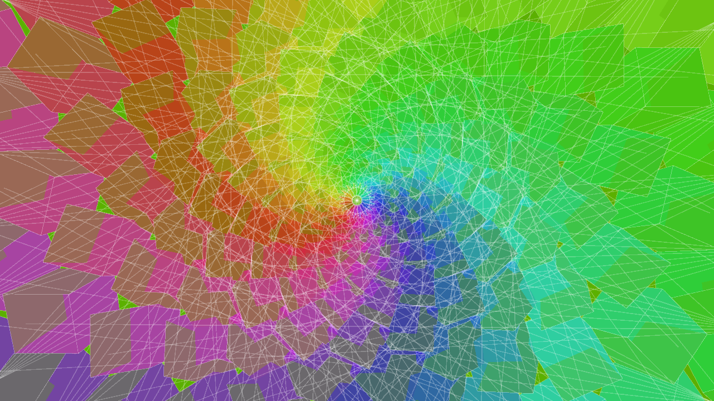

# psychecube
A Processing sketch to generate psychedelic video.

It will make something like this

# How to use
Download psychecube.pde in a directory, run it on a Processing environment.

You can Uncomment the saveFrame() line if you want to save frames in .png files(Be careful: This may be high-load for your PC)

